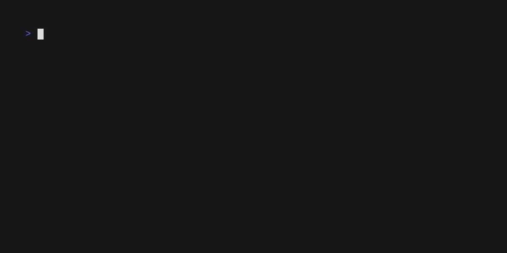

json2struct.nvim
===

A Neovim plugin to covert JSON to a Go struct.

# Installation
First, install [yudppp/json2struct](https://github.com/yudppp/json2struct). This requires a recent Go toolchain installed, which is a fair assumption if you want to be using this plugin.
```shell
    go install github.com/yudppp/json2struct/cmd/json2struct@latest
```
Running the plugin requires `json2struct` to be in the `$PATH`, which the above command will achieve if `$GOPATH/bin` is in the `$PATH`.

## Lazy.nvim
```lua
{
	"triarius/json2struct.nvim",
	config = true,
}
```

# Usage
Select the JSON in Neovim. Enter the command `JSON2Struct`.
The selection will be replaced by a Go struct type that is capable of unmarshalling

# Demo

